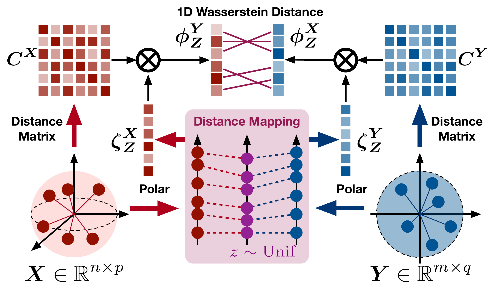

# An Efficient SE($p$)-Invariant Transport Metric Driven by Polar Transport Discrepancy-based Representation
<h4 align="center">
  <a href="https://openreview.net/forum?id=oyxExc7TEl">Openreview</a> | <a href="https://openreview.net/pdf?id=oyxExc7TEl">PDF</a> | <a href="https://iclr.cc/virtual/2026/poster/10007360">ICLR</a> | <a href="https://mp.weixin.qq.com/s/JMUyM_UScUCKwxmcGBlTAQ">WeChat</a>
</h4>

<p align="center">
  
</p>

This repository includes the official implementation of **"An Efficient SE($p$)-Invariant Transport Metric Driven by Polar Transport Discrepancy-based Representation"**

---

## Introduction
Brief introduction to directories and files:
* `SEINT/`: Core code for our implementation of the SEINT/ISEINT algorithm package.
* Experiments for validating metric properties:
   * `SE(p) invariance/`: Code for implementing point cloud classification tasks.
   * `Cross Space tasks/`: Code for implementing cross-space tasks.
   * `High-dimensional data analysis/`: Code for testing with high-dimensional data.
   * `time_cost`: Code for testing computational efficiency
   * `Metric consistency/`: Code for metric consistency detection.
* As a regularization term:
   * `Molecule_Generation/`: Core code for its use as a regularization term in E(3)-equivariant diffusion models.
   * `Point-MAE/`: Core code for its use as a regularization term in Point-MAE.

## Requirements
* python >= 3.8
* numpy
* scipy
* matplotlib
* sklearn
* pytorch >= 2.4.1
* pandas
* POT

---

## Main Experiments
### SE(p) invariance
   1. Evaluate the results in the `SEp_invariance.ipynb` notebook.
      

### Cross Space tasks
   1. Download the [Mesh Data from Deformation Transfer for Triangle Meshes](https://people.csail.mit.edu/sumner/research/deftransfer/data.html) and place it in the `Cross Space tasks/data/` directory.
   2. Run the following script to compute the distance information:
      ```bash
      cd "Cross Space tasks"
      python cross_space_compare.py
      ```
   3. Evaluate the results in the `Cross_Space.ipynb` notebook.

### High-dimensional data analysis
   * Evaluate the results in the `High-dimensional_Analysis.ipynb` notebook.

### Computational Efficiency
   * Evaluate the results in the `Computational_Efficiency.ipynb` notebook.

### Molecular Generation
**Backbone**: [EDM](https://github.com/ehoogeboom/e3_diffusion_for_molecules), [UniGEM](https://github.com/fengshikun/UniGEM)

1. Navigate to the `Molecule_Generation` directory and clone the original backbone repositories. Then, follow their instructions to download the QM9 and Drug datasets.
   ```bash
   cd Molecule_Generation
   git clone https://github.com/ehoogeboom/e3_diffusion_for_molecules.git
   git clone https://github.com/fengshikun/UniGEM.git
   ```

2. Replace the `en_diffusion/en_diffusion.py` file in the cloned EDM & UniGEM repository with the one provided in our `Molecule_Generation` directory.

3. To train EDM and UniGEM on the QM9 dataset, run the following script:
   ```bash
   bash SEINT_train_QM9.sh
   ```

4. To fine-tune UniGEM on the QM9 and DRUG datasets, first download the pre-trained checkpoints as instructed in the original [UniGEM](https://github.com/fengshikun/UniGEM) repository. Then, run the fine-tuning script:
   ```bash
   bash SEINT_ft_DRUG.sh
   ```

5.  To evaluate the trained models, run the corresponding scripts:
    *   On the QM9 dataset:
        ```bash
        bash SEINT_eval_QM9.sh
        ```
    *   On the DRUG dataset:
        ```bash
        bash SEINT_eval_DRUG.sh
        ```
6.  We provide pre-trained checkpoints for evaluation with **SEINT-0.3** in the following directories: `Molecule_Generation/EDM_QM9_ckpt`, `Molecule_Generation/UniGEM_QM9_ckpt`, and `Molecule_Generation/UniGEM_DRUG_ft_ckpt`. You are welcome to use these for testing and reproducing our results. Checkpoints for training will be released soon.
---
## Additional Experiments
### Metric consistency
   1.  Download the [Mesh Data from Deformation Transfer for Triangle Meshes](https://people.csail.mit.edu/sumner/research/deftransfer/data.html), and place the `elephant-reference.obj`, `flam-reference.obj`, and `horse-01.obj` files into the `Metric consistency` directory.
   2.  Run the experiments and view the results in the `Metric consistency/metric consistency.ipynb` notebook.

### Point Cloud Reconstruction with SEINT  
**Base repository**: [Pang-Yatian/Point-MAE](https://github.com/Pang-Yatian/Point-MAE)

We integrate SEINT as a regularization term into the Point-MAE architecture for enhanced point cloud reconstruction performance. To test our implementation:

1. Clone the original repository:
   ```bash
   git clone https://github.com/Pang-Yatian/Point-MAE.git
   ```

2. Replace the following three directories in the original codebase with the modified versions from this repository:
   - `cfgs/`
   - `extensions/chamfer_dist/`
   - `models/`

3. The modifications incorporate SEINT regularization during pretraining.

4. Follow the original training and evaluation instructions in the Point-MAE repository.
---

## Citation

If you found this repository useful, please cite the following.

```bibtex
@inproceedings{lin2026seint,
      title={An Efficient {SE}(p)-Invariant Transport Metric Driven by Polar Transport Discrepancy-based Representation},
      author={Junyi Lin and Dunyao Xue and Jun Yu and Hongteng Xu and Cheng Meng},
      booktitle={The Fourteenth International Conference on Learning Representations},
      year={2026},
      url={https://openreview.net/forum?id=oyxExc7TEl}
}
```


